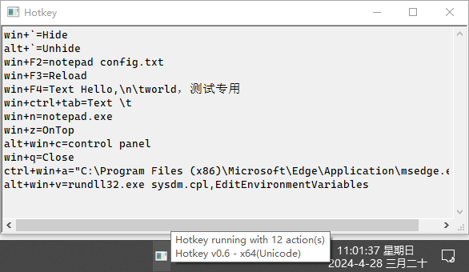

# hotkey

A simple, small, low resource usage but powerfull tool to launch any application via hot key, and show/hide, ontop active window, quick text input, Boss key!

You can define a hot key to input your address quickly.



## Compile

Compile with TCC v0.9.27, compile with Upx:
```bash
# compile x64 - Unicode edition
tcc -m64 -DUNICODE -Wl,-subsystem=gui hotkey.c
# compile x64 - Ascii edition
tcc -m32 -Wl,-subsystem=gui hotkey.c
# compile x86 - Unicode edition
tcc -m64 -DUNICODE -Wl,-subsystem=gui hotkey.c
# compile x86 - Ascii edition
tcc -m32 -Wl,-subsystem=gui hotkey.c
```
